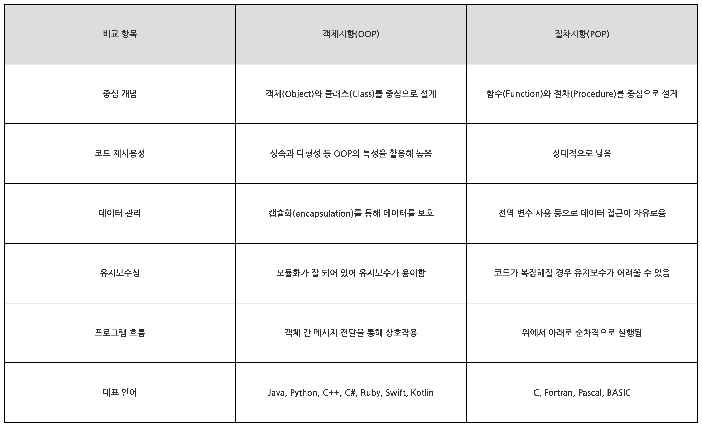
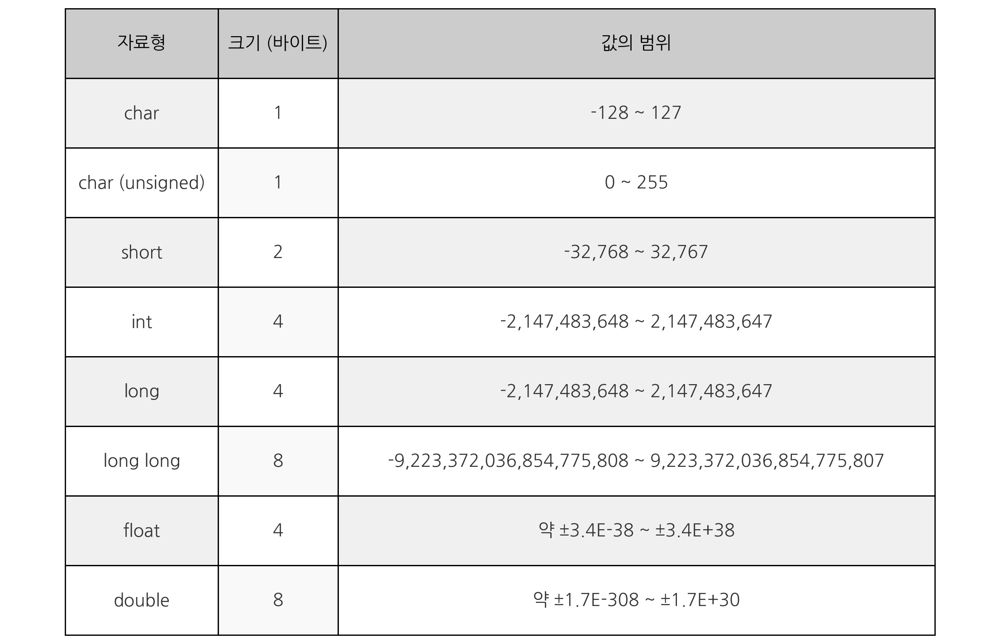

# C-Cpp-Fundamentals
C와 C++ 기초

## 프로그래밍 언어 기초 다지기 전에....

### 컴퓨터 CS 

---
### C언어 동작 과정(원리)

- 전처리 -> 컴파일 -> 어셈블 -> 링크, 이 네가지 과정을 **Build** 라고 함

    ```
    .c --(전처리)--> .i --(컴파일)--> .s --(어셈블)--> .o --(링크)--> .exe
    ```


- 전처리 단계(Preprocess)
    - 전처리기를 통해서 전처리문자(#include 등)들이 전처리 과정을 통해 해당 파일의 코드로 변환 **(.i)**

- 컴파일 과정(Compile)
    - 컴파일러를 통해 컴파일이 되면 고급언어인 코드들이 `저급언어`인 어셈블리어로 변환 **(.s)**

- 어셈블 과정(Assemle)
    - 어셈블러를 통해서 컴퓨터가 이해할 수 있는 `기계어`로 변환 되면서 파일이 생성 **(.o 또는 .obj)**

- 링크 과정(Link)
    - 여러 개의 오브젝트 파일과 라이브러리를 결합하여 하나의 `실행파일(.exe)`을 생성하는 과정
---
### 객체지향(Object-Oriented Programming) VS 절차지향(Procedural-Oriented Programming)



- 객체지향 사용 분야
    - 대규모 프로젝트 (코드의 재사용성과 유지보수가 중요할 때)
    - 협업이 필요한 프로젝트 (클래스 단위로 역할을 나눌 수 있음)
    - GUI 애플리케이션, 모바일 앱, 게임 개발 등

- 절차지향 사용 분야
    - 소규모 프로젝트 (빠르게 구현이 필요할 때)
    - OS, 임베디드 시스템 개발 (하드웨어와 밀접한 관계)
    - 연산 속도가 중요한 프로그램 (C 언어 기반으로 최적화 가능)
---
### 자료형(Data Type)

- [자료형](./CBasics/data_type.cpp)

- 변수를 선언할 때 어떠한 자료의 형태를 나태내는지 설명하는 것
- 변수를 선언할 때 사용, 변수의 크기와 형태를 결정



- 비트와 바이트

    ```
    1 byte = 8bits
    ```
    - 비트(bit): 정보의 최소 단위로, 0 또는 1을 표현
    - 바이트(byte): 8비트로 구성된 정보 단위로, 하나의 문자나 작은 범위의 정수를 표현

    

    - MSB(Most Significant Bit)
        - 왼쪽 끝에 위치한 최상위 비트, 부호 비트로 양수(0)/음수(1) 

    - LSB(Least Significant Bit)
        - 오른쪽 끝에 위치한 비트

- **정수형 자료형**

    - unsigned (부호 없는)
        - unsigned는 양수만 표현하기 때문에 `0 ~ 255` 표현

        ```c
        unsigned char c = 0;
        c = 255; 
        c = -1;    // -1은 2의 보수로 인해 255로 표현
        ```

        - 오버플로우(Overflow)
        ```C / C++
        unsigned cahr c = 0;
        c = 256;

        만약, c = 256 이면,
        char는 1바이트의 크기 0 ~ 255 사이의 값만 표현하기 때문에 `1 0000 0000` 9bit가 되므로 0으로 표현됨
        ```
        
        

    - signed (부호 있는)
        - 1바이트 양수, 음수 둘다 표현
        - -128 ~ 0 ~ 127, 음수, 양수를 다 표한하기 떄문에 최상위 비트를 부호비트로 사용

        ```c
        char c1 = 0;
        c1 = 255        // 255를 넣었는데 -1로 표현됨
        c1 = -1; 
        ```

    - 2의 보수
        - 양수는 이진수 그대로 표현
        - 음수는 해당 양수의 이진수에서 모든 비트를 반전시키고, 그 결과에 1을 더한 값이 됨
            ```
            1101 0101 2의 보수 -> 비트 반전 -> 0010 1010 -> 마지막 비트에 1을 더함 - > 0010 1011
            ```

- **실수형 자료형**

    - 정수와 실수는 메모리를 다루는 방식 자체가 다르다.(표현 방식이 다르다.)
    - 특정 비트값이 정확하게 정해져있는 정수와는 달리 실수 표현방식은 `정밀도`에 의존한다
        - 여기서 정밀도란?
            - 컴퓨터는 실수를 유한한 비트 수로 표현하기 때문에, 모든 실수를 정확하게 저장할 수 없다. 
            따라서, 실수를 표현할 때 근사값으로 저장되며, 이 근사값이 실제 값과 얼마나 일치하는지의 정도를 정밀도라고 함.

    - 부동 소수점
        - 소수점의 위치가 고정되지 않고 부동하는 방식

        

        - 부호 비트 (1bit) : 처음 1bit는 숫자가 양수인지 음수인지를 나타냄. 0은 양수, 1은 음수를 나타낸다.
        - 지수 부분(8bit) : 실수의 유효 숫자를 나타내며, 소수점 이하의 값. 부동 소수점에서는 첫 번째 비트가 항상 1로 고정되고, 이를 숨겨진 비트라고 부른다.
        - 가수 부분(23bit)  : 가수에 소수점의 위치를 지정하는 역할. 이 값은 실수의 크기를 조정하고, 부동 소수점에서 숫자의 범위를 확장하는 데 사용.

        - 10진수 13.25를 부동 소수점으로 변환
            ```
            부호 비트 : 0 (양수)
            지수 부분 : 13 = 0000 1101
            가수 부분 : 0.25 = 01         // 2^-1(0.5), 2^-2(0.25), 2^-3(0.0125)....
            13.25를 부동소수점 변환 : 1101.01
            부동소수점 정규화 : 1.10101 × 2^3 (가수 x 밑수^지수)
            ```
        - 정규화 : 가수의 첫번째 자리가 밑수보다 작은 한자리 자연수로 바꾸는 것을 의미
---
### 연산자

- [연산자1](./CBasics/operator.cpp) / [연산자2](./Day2/operator.c)


- 산술 연산자

    - 종류 : +, -, *, /, %

    ```c
    int data = 10 + 10;     // data에 20 저장
    data = data = 20;       // data += 20;  같은 의미

    data = 10 % 3;          // % (모듈러스, 나머지 연산자) : 피연산자가 모두 정수인 경우 사용

    실수를 상수로 표현할 경우 소수점 뒤에 f 를 붙이면 float 자료형으로, 
    f 를 붙이지 않으면 double 자료형으로 인식
    (0.1f, 0.1; // float, double)
    ``` 

- 증감 연산자

    - 종류 : ++, --

    ```c
    ++data;     // 전위 증감
    data++;     // 후위 증감

    전위 연산자는 우선적으로 수행되며, 후위 연산자는 다른 연산이 먼저 수행된 후에 실행된다.

    data = 0;

	a = 10;
	data = ++a;     // data = 11, a = 11
	data = a++;     // data = 10, a = 11

	전위 증감과 후위 증감 상관없이 변수 공간 자체의 값이 실제로 증가함. 
    ```

- 논리 연산자

    - 종류 : !(NOT), &&(AND), ||(합)
        - ||(OR) : 두 피연산자 중 하나라도 참이면 참을 반환. 둘 다 거짓일 때만 거짓을 반환

    - bool 자료형 : 참과 거짓을 표현하는 논리 자료형, 1바이트 크기를 가지며, 0과 1만을 저장할 수 있습니다.

    ```c
    int truefalse = false;
	bool IsTrue = 100;          // bool : true, false

    참(Ture), 거짓(False)
	참   : 0 이외의 모든 값, 주로 1
	거짓 : 0
    ```

- 비교 연산자
    - 종류 : =, !=, <, <=, >, >=

- 삼항 연산자
    
    - if - else 문으로 간단하게 표현 가능

    ```c
    조건식 ? 참일 때 값 : 거짓일 때 값;

    iTest == 20 ? iTest = 100 : iTest = 200;
    ```

- 비트 연산자 : [연산자1](./CBasics/conditional.cpp) / [연산자2](./Day2/shift.c)
    - 종류 : 쉬프트 연산자 (<<, >>), 비트 논리 연산자 ( &(AND), |(OR), ^(XOR), ~(NOT) )
        - ^(XOR) : 같으면 0, 다르면 1

    ```c
    unsigned char byte = 1;

	byte <<= 3; // 2^n 배수

	byte >>= 1; // 2^n 나눈 몫

    좌측으로 이동 시 맨 오른쪽에 있는 비트는 0으로 채워짐

	우측으로 이동하면 맨 왼쪽에 있는 비트는 부호에 따라 비트가 달라짐
    (음수일 경우 1로 채워지고, 양수일 경우 0으로 채워짐)
    ```
---
### 조건문

- if / else : [조건문](./CBasics/if_else.cpp)
    
    ```c
    if ( 조건식 )
    {
        // if 가 참인 경우 수행
    }
    else if ( 조건식 )
    {
        // if 가 거짓이고 else if가 참이면 수행
    }
    else 
    {
        // if, else if 가 다 거짓이면 실행
    }
    ```

- switch-case : [조건문](./CBasics/switch_case.cpp)

    - 정수형 변수만 사용 가능 (float 불가능)
    - 비교 연산 (>, <, &&, ||) 사용 불가 
    - switch-case 문을 if-else 문으로 변경 가능
 
    ```c
    int iTest = 20;

    switch (변수 : 20)
    {
    case 값(10):
        // 값이 10일 경우 수행
        break;
    case 값(20):
        // 값이 20일 경우 실행
        break;
    default:
        // 위의 모든 case가 실행되지 않을 때 실행
        break;
    }
    ```
---
### 전처리기 #define

- [전처리기](./CBasics/conditional.cpp)

- 전처리기 지시문으로, 특정 기호나 값을 매크로로 정의하는 역할
- 이를 통해 코드 내에서 특정한 값을 일괄적으로 치환하거나, 간단한 매크로 함수를 정의할 수 있습니다.

    ```c
    #define HUNGRY 1

    unsigned int iStatus = HUNGRY;       // iStatus의 값은 1이다.
    ```

-  define 사용으로 인한 이점
    - 코드의 가독성을 높일 수 있다.
    - 코드의 유지보수를 쉽게 할 수 있다.
        - 일일이 수정할 필요 없이 #define에서만 값을 변경하면 일괄 적용
---
### 변수(Variable)

- 값을 저장할 수 있는 메모리 공간, 프로그램의 데이터를 저장하는 기본 단위!

    - **지역 변수** : [지역변수/전역변수](./CBasics/variable.cpp)
        - 함수 내부에 선언된 변수를 의미. 해당 블록 내부에서만 유효하며, 블록이 끝나면 메모리에서 해제

        - 동일한 블록 내에서 같은 이름의 변수를 중복 선언하면 `재정의 오류` 발생!!

            ```c
            int main()
            {
                int iName = 0;  // iName 선언 (main 함수의 지역 변수)

                {
                    int iName = 100;
                    iName = 300;
                }

                int iName = 200;    // 동일한 범위(main 함수)에서 iName 다시 선언 (오류 발생)

                iName = 200;  // 기존 변수를 재사용 (변수 재선언X, 값 변경만)

                return 0;
            }
            ```

    - **전역 변수** : [지역변수/전역변수](./CBasics/variable.cpp)
        - 함수 밖에서 선언된 변수. 프로그램이 시작될 때 생성되며, 프로그램이 종료될 때까지 메모리에 존재

    - 정적 변수 : [정적변수](./CBasics/static_extern_var.cpp) / [헤더파일](./CBasics/common.h)/ [선언파일](./CBasics/func.cpp)
        - static 키워드를 사용

    - 외부 변수 : [외부변수](./CBasics/static_extern_var.cpp) / [헤더파일](./CBasics/common.h)/ [선언파일](./CBasics/func.cpp) / [Extern선언](./CBasics/extern_test.cpp)
        - extern 키워드 사용
---
#### Lvalue 와 Rvalue

- Lvalue : 좌변에 올 수 있는 값, 메모리 주소를 가지며 수정이 가능한 값

    - 메모리 주소(& 연산자로 확인 가능)를 가짐
    - 변할 수 있는 값 (예: int x = 10; x = 20; → x 값이 변할 수 있음)
    - 참조형(&) 변수로 받을 수 있음

        ```c
        int x = 10; // x는 Lvalue
        x = 20; // x는 Lvalue이므로 좌변에 올 수 있음

        int& ref = x; // Lvalue 참조는 Lvalue에만 할당 가능
        ```
            
- Rvalue : 우변에만 올 수 있는 값, 보통 임시적인 값을 의미. 
           즉, 특정한 메모리에 저장되지 않거나, 한 번 생성된 후 더 이상 변경되지 않는 값

    - 식의 우변(Right)에 올 수 있음 (x = 10 + 20; 에서 10 + 20 부분)
    - 주소가 없음 (일반적으로)
    - 수정할 수 없음
    - C++11부터 Rvalue 참조 (int&&) : 임시 객체(Rvalue)를 직접 참조할 수 있도록 하는 기능

        ```c
        int a = 10 + 20; // 10 + 20은 Rvalue

        int& ref = 10; // 오류! Lvalue 참조는 Rvalue를 받을 수 없음

        int&& rref = 10; // Rvalue 참조는 Rvalue를 받을 수 있음

        int&& rref2 = x; // 오류! Lvalue는 Rvalue 참조(int&&)에 할당할 수 없음

        ```

    - `리터럴(Literal)` : 값 자체를 의미하는 상수

        ```c
        int x = 10; // 10은 Rvalue

        int& ref = 10; // 오류! Lvalue 참조는 Rvalue를 받을 수 없음

        const int& ref = 10; // const Lvalue 참조는 Rvalue를 받을 수 있음

        const char* str = "Hello"; // "Hello"는 문자열 리터럴인데, 문자열 리터럴은 예외적으로 Lvalue
        ```
---
### 반복문

- [반복문](./CBasics/loop.cpp)

- for 문
    - 반복 횟수가 정해진 경우

    ```c
    for (/* 반복자 초기화 */; /* 반복자 조건 체크 */; /* 반복자 변경(증가/감소) */) {
    // 반복 실행할 코드
    }
    ```

- while 문
    - 조건이 참인 동안 반복

    ```c
    while (조건) {
    // 반복 실행할 코드
    }
    ```

- do-while 문
    - 최초 한번 실행 후 조건에 따라 반복

    ```c
    do {
    // 반복 실행할 코드
    } while (조건);
    ```
- 반복문 제어하는 데 사용되는 키워드

    - `break` : 현재 실행 중인 반복문을 즉시 종료하고 반복문 바깥으로 이동
    - `continue` : 현재 반복을 건너뛰고 다음 반복을 진행
---
### 함수(Function)