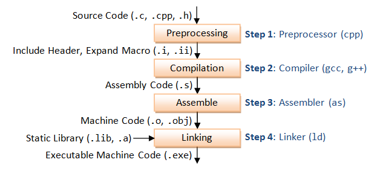
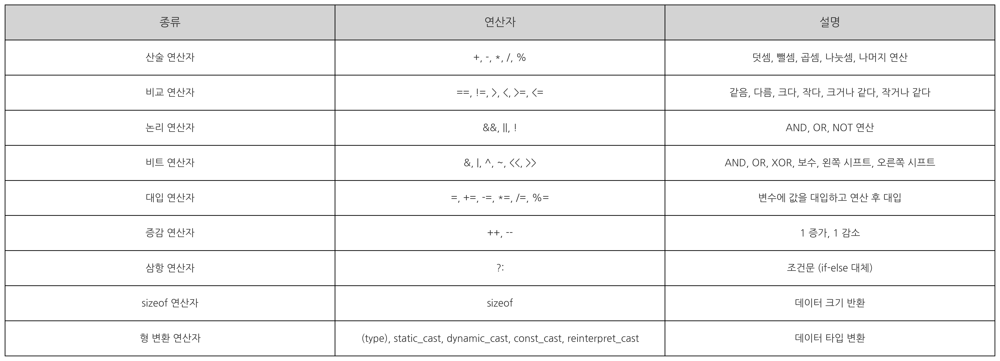
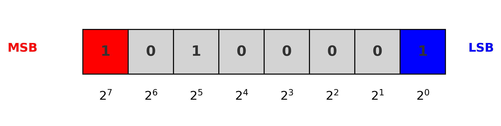
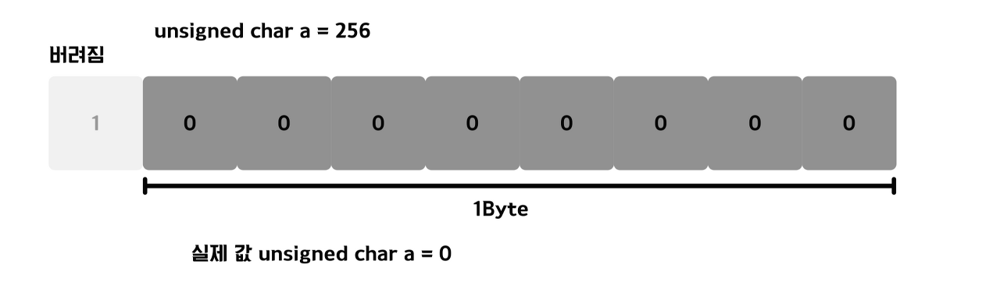
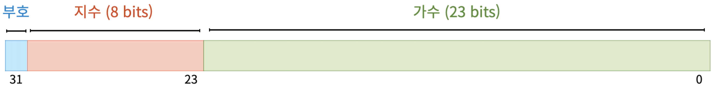

# C-Cpp-Fundamentals
C와 C++ 기초

## 프로그래밍 언어 기초 다지기 전에....

### C언어 동작 원리

- 전처리 -> 컴파일 -> 어셈블 -> 링크, 이 네가지 과정을 **Build** 라고 함

```
.c --(전처리)--> .i --(컴파일)--> .s --(어셈블)--> .o --(링크)--> .exe
```



- **전처리 단계(Preprocess)**
    - 전처리기를 통해서 전처리문자(#include 등)들이 전처리 과정을 통해 해당 파일의 코드로 변환

- **컴파일 과정(Compile)**
    - 컴파일러를 통해 컴파일이 되면 고급언어인 코드들이 `저급언어`인 어셈블리어로 변환

- **어셈블 과정(Assemle)**
    - 어셈블러를 통해서 어셈블리어가 컴퓨터가 이해할 수 있는 기계어로 변환 되면서 파일이 생성

- **링크 과정(Link)**
    - 여러 파일들로 흩어져있는 기계어로 변환된 .c, .cc, .h 파일들을 하나의 실행파일(.exe)로 링킹을 시켜 하나로 모오는 과정



### 자료형(Data Type) : [C/C++](./CBasics/data_type.cpp)

- 변수를 선언할 때 어떠한 자료의 형태를 나태내는지 설명하는 것
- 변수를 선언할 때 사용, 변수의 크기와 형태를 결정


| 자료형        | 크기 (바이트) | 값의 범위                                                                   |
|---------------|---------------|-----------------------------------------------------------------------------|
| `char`        | 1             | -128 ~ 127 (signed : 부호 있는 경우)                                        |
|               |               |  0 ~ 255 (unsigned : 부호 없는 경우)                                        |
| `short`       | 2             | -32,768 ~ 32,767                                                            |
| `int`         | 4             | -2,147,483,648 ~ 2,147,483,647                                              |
| `long`        | 4             | -2,147,483,648 ~ 2,147,483,647                                              |
| `long long`   | 8             | -9,223,372,036,854,775,808 ~ 9,223,372,036,854,775,807                      |
| `float`       | 4             | 약 ±3.4E-38 ~ ±3.4E+38                                                      |
| `double`      | 8             | 약 ±1.7E-308 ~ ±1.7E+30                                                     |

- 비트와 바이트

    ```
    1 byte = 8bits
    ```
    - 비트(bit): 정보의 최소 단위로, 0 또는 1을 표현
    - 바이트(byte): 8비트로 구성된 정보 단위로, 하나의 문자나 작은 범위의 정수를 표현

    

    - MSB(Most Significant Bit)
        - 왼쪽 끝에 위치한 최상위 비트, 부호 비트로 양수(0)/음수(1) 

    - LSB(Least Significant Bit)
        - 오른쪽 끝에 위치한 비트

    ```
    unsigned cahr c = 0;
    ```
    - 1바이트의 크기 unsigned cahr 변수 선언하고 0으로 초기화
    - unsigned는 양수만 표현하기 때문에 `0 ~ 255` 표현

    ```
    c = 256;
    ```
    - 만약, `c = 256` 이면 
    - char는 1바이트의 크기 0 ~ 255 사이의 값만 표현하기 때문에 `1 0000 0000` 9bit가 되므로 0으로 표현됨

     


#### 정수형 자료형 : [C/C++](./CBasics/data_type.cpp)

- unsigned (부호 없는)
    - 부호 없는 1바이트 정수형 0 ~ 255 표현

    ```
	unsigned char c = 0;
	c = 255; 
	c = -1;    // -1은 2의 보수로 인해 255로 표현
    ```

- signed (부호 있는)
    - 1바이트 양수, 음수 둘다 표현
	- -128 ~ 0 ~ 127, 음수, 양수를 다 표한하기 떄문에 최상위 비트를 부호비트로 사용

    ```
	char c1 = 0;
    c1 = 255        // 255를 넣었는데 -1로 표현됨
	c1 = -1; 
    ```

##### 2의 보수
- 양수는 이진수 그대로 표현
- 음수는 해당 양수의 이진수에서 모든 비트를 반전시키고, 그 결과에 1을 더한 값이 됨
```
1101 0101 2의 보수 -> 비트 반전 -> 0010 1010 -> 마지막 비트에 1을 더함 - > 0010 1011
```

#### 실수형 자료형 : [C/C++](./CBasics/data_type.cpp)

- 정수와 실수는 메모리를 다루는 방식 자체가 다르다.(표현 방식이 다르다.)
- 특정 비트값이 정확하게 정해져있는 정수와는 달리 실수 표현방식은 `정밀도`에 의존한다
    - 여기서 정밀도란?
        - 컴퓨터는 실수를 유한한 비트 수로 표현하기 때문에, 모든 실수를 정확하게 저장할 수 없다. 
          따라서, 실수를 표현할 때 근사값으로 저장되며, 이 근사값이 실제 값과 얼마나 일치하는지의 정도를 정밀도라고 함.

- 부동 소수점
    - 소수점의 위치가 고정되지 않고 부동하는 방식

    

    - 부호 비트 (1bit) : 처음 1bit는 숫자가 양수인지 음수인지를 나타냄. 0은 양수, 1은 음수를 나타낸다.
    - 지수 부분(8bit) : 실수의 유효 숫자를 나타내며, 소수점 이하의 값. 부동 소수점에서는 첫 번째 비트가 항상 1로 고정되고, 이를 숨겨진 비트라고 부른다.
    - 가수 부분(23bit)  : 가수에 소수점의 위치를 지정하는 역할. 이 값은 실수의 크기를 조정하고, 부동 소수점에서 숫자의 범위를 확장하는 데 사용.

    - 10진수 13.25를 부동 소수점으로 변환
    ```
    부호 비트 : 0 (양수)
    지수 부분 : 13 = 0000 1101
    가수 부분 : 0.25 = 01         // 2^-1(0.5), 2^-2(0.25), 2^-3(0.0125)....
    13.25를 부동소수점 변환 : 1101.01
    부동소수점 정규화 : 1.10101 × 2^3 (가수 x 밑수^지수)
    ```
    - 정규화 : 가수의 첫번째 자리가 밑수보다 작은 한자리 자연수로 바꾸는 것을 의미